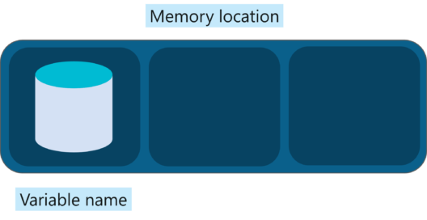

#### What is JavaScript?

JavaScript is a high level, interpreted, programming language used to make web pages more interactive.

JavaScript is the language of the web, it is used to make the web look alive by adding motion to it. To be more precise, it’s a programming language that lets you implement complex and beautiful things/design on web pages

#### Feature of JavaScript :

-   **Scripting language and not Java:** In fact, JavaScript has nothing to do with Java. Then why is it called “Java” Script? When JavaScript was first released it was called Mocha, it was later renamed to LiveScript and then to JavaScript when Netscape (founded JavaScript) and Sun did a license agreement.
-   **Object-based scripting language** supports polymorphism, encapsulation and to some extent inheritance as well.
-   **Interpreted language:** It doesn’t have to be compiled like Java and C which require a compiler.
-   **JavaScript runs in a browser:** You can run it on Google Chrome, Internet Explorer, Safari, etc. JavaScript can execute not only in the browser but also on the server and any device which has a JavaScript Engine.

#### JavaScript Fundamentals :

-   Variables: Variable is a name given to a memory location that acts as a container for storing data temporarily. They are nothing but reserved memory locations to store values.

To declare a variable in JavaScript use the ‘let’ keyword. For example:

let age;

age=22;

-   Three types of variable declaration method :

1.  Let
2.  Var
3.  Const

-   Datatypes -: In the JavaScript mainly two data types are present

1.  Primitive — : It can define as data that is not an object and no methods.

For Example :

-   Numbers — 1,2,3…
-   String- “Akshay”, “Pune”
-   Boolean- true, false
-   null
-   undefined
-   symbol- $, #,@,%

2\. Non-Primitive(Reference) -:

-   Object- An object is a standalone entity with properties and types and it is a lot like an object in real life.

let person={

name: “Akshay”,

age: 23'

address: “Pune”

-   Arrays- an array is a data structure that contains a list of elements that store multiple values in a single variable.

let arrNumber=\[1,2,3,4,5,6\]

-   Functions- A function is a block of organized, reusable code that is used to perform single, related action.

Let’s create a function that calculates the product of two numbers.

To declare a function in JavaScript use the ‘function’ keyword. For example:

function(a,b){

returna\*b;

}

#### Conditional statements — if

A conditional statement is a set of rules performed if a certain condition is met. The ‘if’ statement is used to execute a block of code, only if the condition specified holds true.

#### Conditional statements- Else if

Else statement is used to execute a block of code if the same condition is false.

if (condition){

statement a;

}else{  
statement b;

}

#### Loops

Loops are used to repeat a specific block until some end condition is met. There are three categories of loops in JavaScript :

1.  while loop -While the condition is true, the code within the loop is executed.

while(condition){  
loop code  
}

2\. do-while loop -This loop will first execute the code, then check the condition and while the condition holds true, execute repeatedly.

do{  
loop code;  
}while(condition);

3\. for loop -The for loop repeatedly executes the loop code while a given condition is TRUE. It tests the condition before executing the loop body.

for (begin;condition;step){  
loop code;  
}

-   **begin** statement is executed one time before the execution of the loop code
-   **condition** defines the condition for executing the loop code
-   **step** statement is executed every time after the code block has been executed

#### Switch Case

The switch statement is used to perform different actions based on different conditions.

switch(expression){

case 1:

code block 1

break;

case 2:

code block 2

break;

default :

code block 3

break;

}

-   Switch expression gets evaluated once
-   Value of the expression is compared with the values of each case
-   If there is a match, the associated block of code is executed
