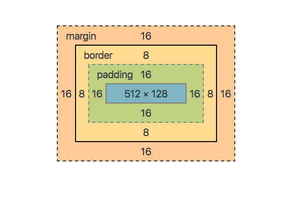

This article will brief you about the **_CSS Box Model._**

1.  What is the box-model ?

According to the box-model concept, every element on a page is a rectangular box and may have width, height, padding, borders, and margins. That’s worth repeating: Every element on a page is a rectangular box.

2\. Working with the Box Model :

Every element is a rectangular box, and there are several properties that determine the size of that box. The core of the box is defined by the width and height of an element, which may be determined by the `display` property, by the contents of the element, or by specified `width` and `height` properties. `padding` and then `border` expand the dimensions of the box outward from the element’s width and height. Lastly, and `margin` we have specified will follow the border.

3\. Box- Model Property -:



a. Border: It is the area between the box’s padding and margin. Its dimensions are given by the width and height of the border.

b. Margin: This area consists of space between border and margin. The dimensions of the Margin area are the margin-box width and the margin-box height. It is useful to separate the element from its neighbors.

c. Padding: It includes the element’s padding. This area is actually the space around the content area and within the border-box. Its dimensions are given by the width of the padding-box and the height of the padding-box.

d. Content: This area consists of content like text, image, or other media content. It is bounded by the content edge and its dimensions are given by content-box width and height.

4\. Display Properties of Box-Model :

-   Block-level elements
-   Inline-level elements
-   Block -: A block-level elements accept all the box-model properties and values. To convert any element into a block-level element we just need to change its display property.

```
span {
    display: block;
  }
```

-   Inline -: To make any element behave like inline-level elements we can change its display properties.

```
p {
    display: inline;
  }
```

-   Inline-Block -: An inline-level element does not accept all the box-model properties and values. So we have another display property value i.e. inline-block.

```
p {
    display: inline-block;
  }
```
