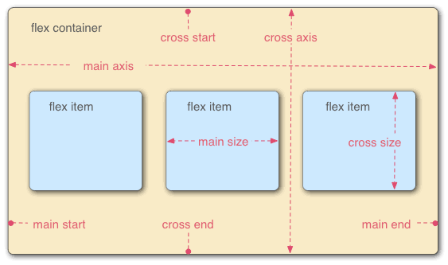
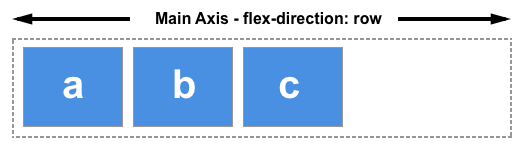
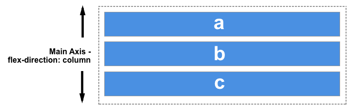
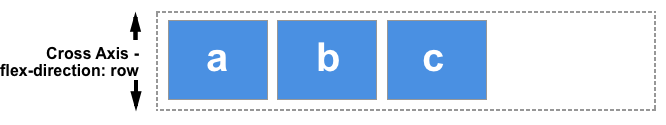
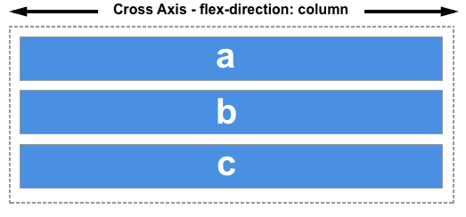
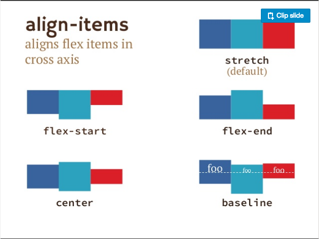
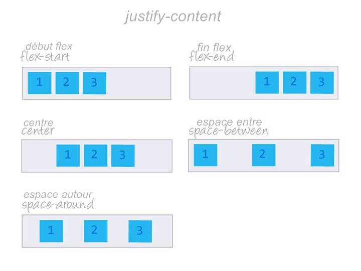

### This article will brief you about the flex-box in CSS

-   flex-box -:Flexbox provides us a more efficient way to layout elements. It gives us the ability to align the items and distribute space among the items in a container — even though the size of the elements is unknown or dynamic.

#### The two axes of flexbox -:

The main axis-: The main axis is defined by flex-direction, which has four possible values:

-   row
-   row-reverse
-   column
-   column reverse

you choose row or row-reverse, your main axis will run along the row in the inline direction

Choose column or column-reverse and your main axis will run from the top of the page to the bottom — in the block direction.

The cross axis -:The cross axis runs perpendicular to the main axis, therefore if your flex-direction (main axis) is set to row or row-reverse the cross axis runs down the columns.

If your main axis is column or column-reverse then the cross axis runs along the rows.

#### Properties of flex-parent -:

-   **align-items** \-: The align-items property will align the items on the cross axis.
-   stretch
-   flex-start
-   flex-end
-   center

-   **justify-content** -:The justify-content property is used to align the items on the main axis
-   flex-start
-   flex-end
-   center
-   space-around
-   space-between
-   space-evenly

#### Properties applied to flex items -:

-   **flex-basis** -: The flex-basis is what defines the size of that item in terms of the space it leaves as available space. The initial value of this property is auto— in this case, the browser looks to see if the items have a size. In the example above, all of the items have a width of 100 pixels and so this is used as the flex-basis.
-   **flex-grow** -:With the flex-grow property set to a positive integer, flex items can grow along the main axis from their flex-basis. This will cause the item to stretch and take up any available space on that axis, or a proportion of the available space if other items are allowed to grow too.
-   **flex-shrink** -: Where the flex-grow property deals with adding space in the main axis, the flex-shrink property controls how it is taken away. If we do not have enough space in the container to lay out our items and flex-shrink is set to a positive integer the item can become smaller than the flex-basis. As with flex-grow different values can be assigned in order to cause one item to shrink faster than others — an item with a higher value set for flex-shrink will shrink faster than its siblings that have lower values.
