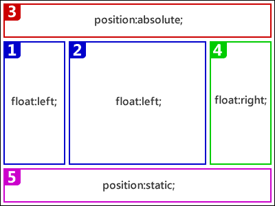
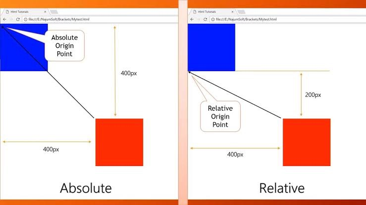

There are a few different types of positioning within CSS, and each has its own application.



#### Positioning with Floats -:

One way to position elements on a page is with the `float` property. The `float` property is pretty versatile and can be used in a number of different ways.

For example :

```
img {
  float: left;
}
```

#### Clearing Floats -:

Clearing floats is accomplished using the `clear` the property, which accepts a few different values: the most commonly used values being `left`, `right`, and `both`.

```
div {
  clear: left;
}
```

#### Clearfix -:

One of the most effective ways to contain floats is the clearfix method. In this method, we apply a class to parent element containing floated elements and then we define some sort rules to that class in CSS.

```

  ========================================
  Clearfix
  ========================================
.clearfix:before, clearfix:after {

     content="";
     diplay: table;
}
.clearfix:after {
  clear:both;
}
```

There are a number of different types of positioning that you can put into effect on HTML elements. To make a specific type of positioning active on an element, we use the `[position](https://developer.mozilla.org/en-US/docs/Web/CSS/position "The position CSS property sets how an element is positioned in a document. The top, right, bottom, and left properties determine the final location of positioned elements.")` property.

#### 1\. Static positioning -:

Static positioning is the default that every element gets — it just means “put the element into its normal position in the document layout flow — nothing special to see here.”

#### 2.Relative positioning -:

Relative positioning is the first position type we’ll take a look at. This is very similar to static positioning, except that once the positioned element has taken its place in the normal layout flow, you can then modify its final position, including making it overlap other elements on the page. Go ahead and update the `position` declaration in your code:

```
position: relative;
```

#### 3.Absolute positioning -:

Absolute positioning brings very different results. Let’s try changing the position declaration in your code as follows:

```
position: absolute;
```
