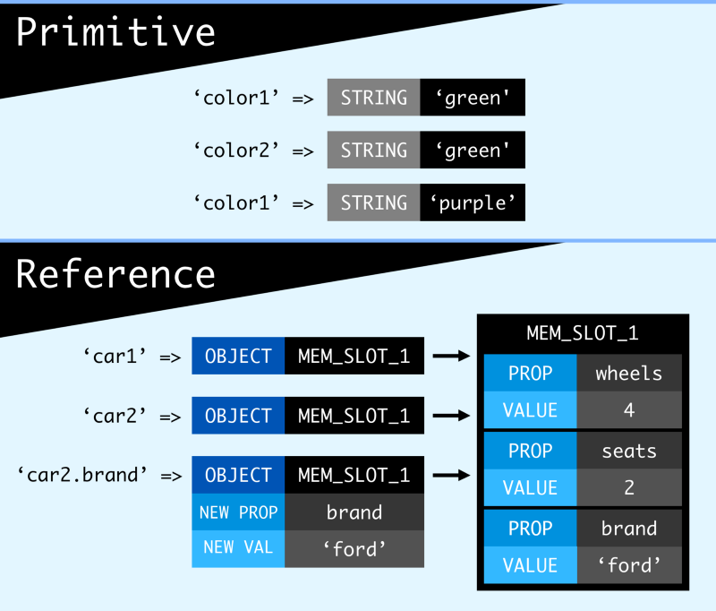

In this article brief about the difference between primitive and non-primitive.

#### What are Primitive and Non-Primitive values?

First, we understand the definition and details of Primitive and Non-Primitive values.

#### Primitive — :

It can define as data that is not an object and no methods.

For Example :

1.Numbers — 1,2,3…

2\. String- “Akshay”, “Pune”

3\. Boolean- true, false

4.null

5.undefined

6.symbol- $, #,@,%

#### Non-Primitive(Reference) -:

-   Object- An object is a standalone entity with properties and types and it is a lot like an object in real life.

let person={

name: “Akshay”,

age: 23'

address: “Pune”

-   Arrays- an array is a data structure that contains a list of elements that store multiple values in a single variable.

let arrNumber=\[1,2,3,4,5,6\]

-   Functions- A function is a block of organized, reusable code that is used to perform single, related action.

Let’s create a function that calculates the product of two numbers.

To declare a function in JavaScript uses the ‘function’ keyword. For example:

function(a,b){

returna\*b;

}

#### Lets understand how primitives and objects differ by understanding their nature.

#### Primitive-

-   Primitives are known as being immutable data types because there is no way to change a primitive value once it gets created.
-   Primitives are compared by value. Two values are strictly equal if they have the same value.
-   Primitives are immutable. Any property you add will be forgotten immediately.
-   Primitive value stores the actual data in a variable.
-   Primitive variables are copied by values or data

#### Non-Primitive(Object values) -:

-   Objects are mutable.
-   Objects have unique identities and are compared by reference. Every object you create is different. Two objects will be only equal if they have the same identity. It does not matter if they have the same content or not. The fact can be determined by `===` operator.
-   Objects store only memory address or memory reference in the variable, the actual value or data are located somewhere in the memory.
-   Objects are copied by references.
