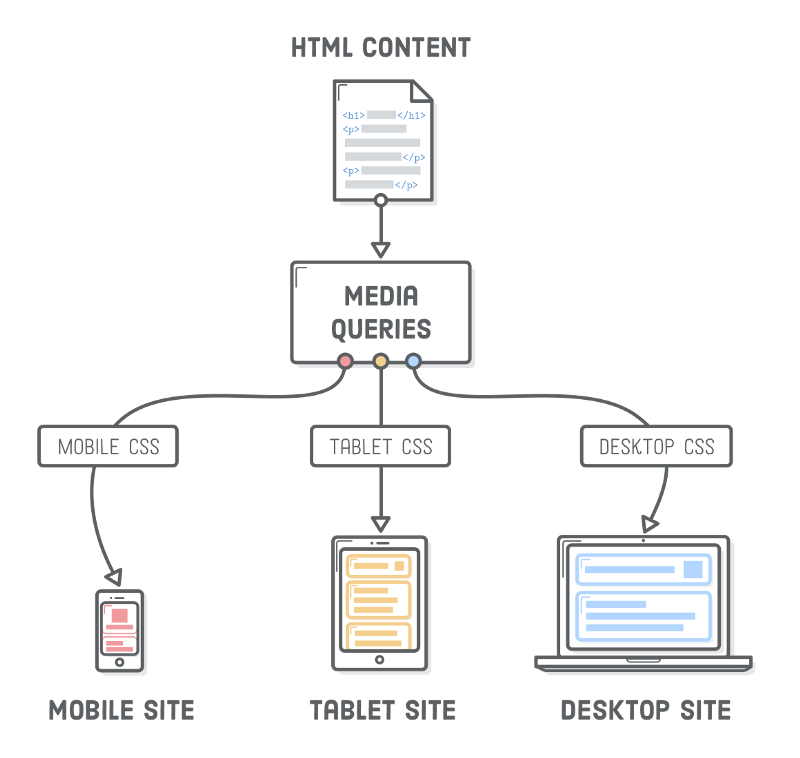
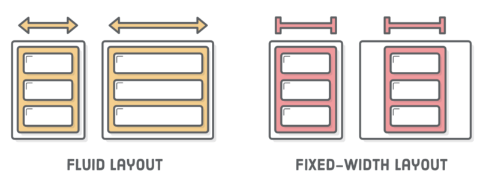
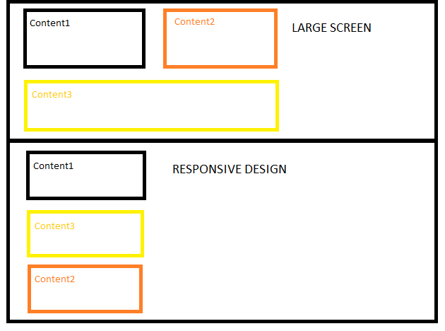

### This article will brief you about the Responsive Web-Design

-   what is responsive web design?

“Responsive design” refers to the idea that your website should display equally well in everything from widescreen monitors to mobile phones. It’s an approach to web design and development that eliminates the distinction between the mobile-friendly version of your website and its desktop counterpart. With responsive design, they’re the same thing.



There are 3 main pieces to make your website responsive:

#### 1\. Flexible Layouts

#### 2\. Responsive Images

#### 3\. Media Queries

#### 1.Flexible layouts -:

The first part, flexible layouts, is the practice of building the layout of a website with a flexible grid, capable of dynamically resizing to any width. Flexible grids are built using relative length units, most commonly percentages or em units.



#### 2.Responsive Images -:

The second piece of responsive web design is responsive images. Making your images responsive is a very important step because it can affect both your website's speed and its search engine friendliness.

Responsive Images grow and shrink with a user’s browser to fit the web page. If you use a very large image (both in file size and pixels) then it will take a long time to load on a device that’s connected to 3G or slower.

#### 3\. Media Queries -:

Along with fluid layouts and responsive images, media queries are required to have a responsive website. Media queries allow you to add device-specific rules for hiding, growing, moving or showing content to allow for better user experience.

Using CSS, Media Queries allow for different user interfaces for each device.

For example, let’s say you have a button on your website but you want to hide it when the visitor is viewing on a mobile device. With a small piece of code you can do this:

```
/* Smartphones (portrait and landscape) ----------- */
@media only screen and (min-device-width : 320px) and (max-device-width : 480px) {
/* Styles */
.button {display:none}
}
```

Having a responsive website is a necessity. More visitors are browsing websites from mobile devices so it’s important your website looks good or they will leave. Converting your website to responsive can be a large task for some small businesses but if you follow this post, you can have a website that works on any device.



### Mobile First

One popular technique with using media queries is called _mobile-first_. The [mobile-first](http://www.lukew.com/presos/preso.asp?26) approach includes using styles targeted at smaller viewports as the default styles for a website, then use media queries to add styles as the viewport grows.

The operating belief behind the mobile-first design is that a user on a mobile device, commonly using a smaller viewport, shouldn’t have to load the styles for a desktop computer only to have them overwritten with mobile styles later. Doing so is a waste of bandwidth. A bandwidth that is precious to any users looking for a snappy website.

The mobile-first approach also advocates designing with the constraints of a mobile user in mind. Before too long, the majority of Internet consumption will be done on a mobile device. Plan for them accordingly and develop intrinsic mobile experiences.
